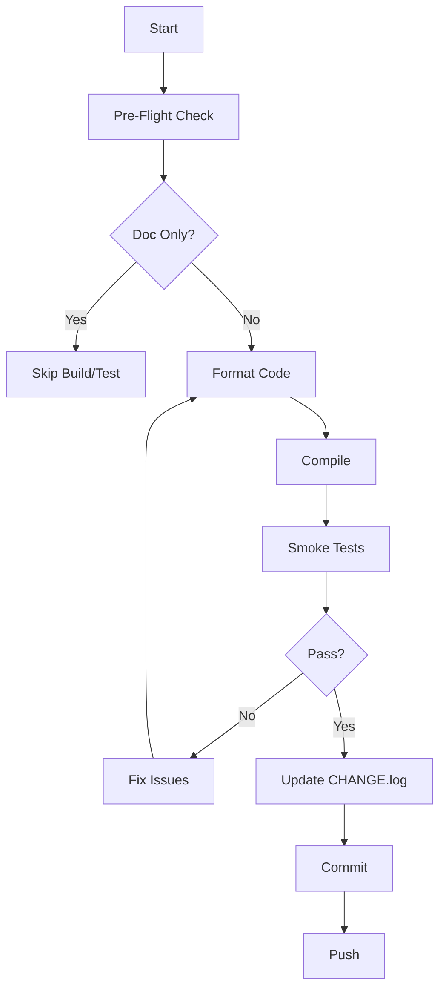

# AI Workflow Rules Analysis & Improvement Recommendations

**Date:** November 15, 2025
**Document Analyzed:** `docs/process/AI_WORKFLOW_RULES.md`
**Current Status:** Version 2.9, 1,745 lines

---

## 📊 Executive Summary

### Current State Assessment

**Strengths:**
- ✅ Comprehensive coverage of core workflows
- ✅ Well-documented verification processes
- ✅ Clear version history and change tracking
- ✅ Detailed examples and templates
- ✅ Strong security focus (password rules)

**Areas for Improvement:**
- ⚠️ **Length:** 1,745 lines makes it hard to navigate quickly
- ⚠️ **Structure:** Some redundancy and unclear hierarchy
- ⚠️ **Missing:** Several important workflows not covered
- ⚠️ **Quick Reference:** Could be more scannable

### Key Findings

1. **Efficiency Opportunities:** ~30% reduction possible through consolidation
2. **Missing Workflows:** 8 critical workflows not documented
3. **Navigation:** Needs better indexing and cross-references
4. **Quick Reference:** Should be at top for daily use

---

## 🎯 Part 1: Efficiency Improvements

### 1.1 Structure Reorganization

**Current Issue:** Rules are numbered inconsistently (Rule 1, Rule 2, Rule 2.5, Rule 2.6, Rule 3, etc.)

**Recommendation:** Reorganize into clear hierarchical structure:

```
1. MANDATORY RULES (Pre-flight, Verification, Commit)
2. CODE QUALITY RULES (Linter, Formatting, Checkstyle)
3. TESTING RULES (Smoke, Full Suite, API, Performance)
4. BRANCHING RULES (Feature Branches, Hotfixes)
5. DOCUMENTATION RULES (Markdown, Metadata, CHANGE.log)
6. SECURITY RULES (Passwords, Secrets)
7. EXCEPTION HANDLING (Flaky Tests, Network Errors)
8. QUICK REFERENCE (Daily Commands)
```

**Benefit:** Easier to find specific rules, clearer hierarchy

---

### 1.2 Consolidate Redundant Content

**Redundancy Found:**

1. **Version History (Lines 5-116):** ~110 lines of change history
   - **Recommendation:** Move to separate `CHANGELOG.md` or append to end
   - **Benefit:** Save ~100 lines, easier to maintain

2. **Quick Reference Duplication:**
   - Lines 1577-1648: Quick Reference
   - Lines 489-606: Detailed verification steps (redundant info)
   - **Recommendation:** Keep detailed in rules, concise version in Quick Reference only

3. **Example Code Snippets Repeated:**
   - URL constructor fix appears in Rule 11 (lines 1427-1434) and elsewhere
   - **Recommendation:** Reference single canonical example

**Estimated Reduction:** ~200-250 lines

---

### 1.3 Improve Navigation

**Current Issues:**
- No table of contents
- Hard to jump to specific rules
- Cross-references not always clear

**Recommendations:**

1. **Add Table of Contents at Top:**
```markdown
## 📑 Table of Contents

### MANDATORY RULES
- [Rule 1: Pre-Flight Verification](#rule-1-pre-flight-verification)
- [Rule 2: Batch Size Limits](#rule-2-batch-size-limits)
...

### CODE QUALITY
- [Rule 3: Post-Change Verification](#rule-3-post-change-verification)
...
```

2. **Add Rule Index:**
```markdown
## 📋 Rule Index (Quick Find)

| Rule | Topic | Section |
|------|-------|---------|
| 1 | Pre-Flight | Mandatory |
| 2 | Batch Size | Mandatory |
| 2.5 | Markdown Files | Documentation |
...
```

3. **Add Cross-References:**
```markdown
See also: [Rule 8: Feature Branch Workflow](#rule-8-feature-branch-workflow) for branch naming.
Related: [Rule 11: Linter Warnings](#rule-11-linter-warnings-fix-process) for code quality.
```

---

### 1.4 Quick Reference Optimization

**Current:** Quick Reference at lines 1577-1648 (71 lines)

**Recommendation:** Create **TWO** Quick References:

1. **Ultra-Quick Daily Reference** (at top, ~20 lines):
   - Just the essential commands
   - No explanations
   - Most common workflow only

2. **Comprehensive Reference** (current location):
   - Detailed explanations
   - All workflows
   - Edge cases

**Benefit:** 80% of users need quick access, 20% need details

---

### 1.5 Section Consolidation

**Consolidate These Sections:**

1. **Version History → Append at End**
   - Current: Lines 5-116 (top of document)
   - Better: End of document or separate file
   - Reason: Not needed for daily use

2. **Exception Handling → Single Section**
   - Current: Scattered (Lines 634-661, 1560-1575, 1685-1730)
   - Better: One comprehensive "Exception Handling" section
   - Location: After rules, before Quick Reference

3. **Testing Rules → Consolidate**
   - Current: Scattered (Rule 3, Rule 9, Lines 1651-1683)
   - Better: Single "Testing Workflow" section

---

## 🔍 Part 2: Missing Critical Workflows

### 2.1 API Testing Workflow ⚠️ HIGH PRIORITY

**Missing:** Dedicated workflow for API testing (REST Assured)

**Should Include:**
- When to run API tests vs UI tests
- API test execution commands
- API test verification steps
- No Grid required workflow

**Recommended Addition:**
```markdown
### **Rule 12: API Testing Workflow** 🌐

**Principle:** API tests run independently of Selenium Grid and have different verification needs.

**When to Use:**
- ✅ Testing REST endpoints
- ✅ Contract testing
- ✅ Fast feedback loop (no browser overhead)
- ✅ CI/CD pipeline validation

**Workflow:**
1. Run API tests: `./scripts/run-api-tests.sh`
2. Verify: All 31 API tests pass
3. No Grid setup required
4. No Docker required (can run with Maven directly)

**Verification:**
- ✅ All API tests pass (31/31)
- ✅ Response validation successful
- ✅ Contract tests pass
```

---

### 2.2 Multi-Environment Testing Workflow ⚠️ HIGH PRIORITY

**Missing:** How to handle dev/test/prod environment testing

**Should Include:**
- Environment selection process
- Environment-specific configurations
- Environment-specific test execution
- Verification for each environment

**Current Evidence:**
- `docker-compose.dev.yml` and `docker-compose.prod.yml` exist
- GitHub Actions has multi-environment workflow
- No documentation in AI_WORKFLOW_RULES.md

**Recommended Addition:**
```markdown
### **Rule 13: Multi-Environment Testing** 🌍

**Environments:**
- `dev` - Development environment
- `test` - Test/QA environment
- `prod` - Production environment

**Workflow:**
1. Select environment: `export ENV=dev` (or test/prod)
2. Use appropriate compose file: `docker-compose -f docker-compose.${ENV}.yml`
3. Run environment-specific tests
4. Verify environment-specific configs

**Commands:**
```bash
# Dev environment
docker-compose -f docker-compose.dev.yml up -d

# Prod environment
docker-compose -f docker-compose.prod.yml run --rm tests test -Dtest=SmokeTests
```
```

---

### 2.3 Performance Testing Workflow ⚠️ MEDIUM PRIORITY

**Missing:** How to handle Gatling/JMeter/Locust tests

**Current:** Lines 1687-1730 say "NEVER run automatically" but no workflow when user requests it

**Should Include:**
- When to run performance tests
- How to run each tool (Gatling, JMeter, Locust)
- Performance test verification criteria
- When to schedule vs run on-demand

**Recommended Addition:**
```markdown
### **Rule 14: Performance Testing Workflow** ⚡

**Principle:** Performance tests are manual-only, resource-intensive, and require infrastructure setup.

**When to Run:**
- ✅ User explicitly requests
- ✅ Before major releases
- ✅ Performance regression investigation
- ✅ Load capacity planning

**Tools Available:**
1. **Gatling** (Scala-based)
   - Command: `./scripts/run-gatling-tests.sh`
   - Duration: 10-30 minutes

2. **JMeter** (Java-based)
   - Command: `./scripts/run-jmeter-tests.sh`
   - Duration: 15-30 minutes

3. **Locust** (Python-based)
   - Command: `./scripts/run-locust-tests.sh`
   - Duration: 10-20 minutes

**Before Running:**
1. ✅ Confirm with user
2. ✅ Verify infrastructure ready
3. ✅ Check target environment capacity
4. ✅ Schedule during off-hours (if production)

**After Running:**
1. ✅ Analyze results
2. ✅ Document findings
3. ✅ Compare with baseline
4. ✅ Report if regressions found
```

---

### 2.4 Pull Request Workflow ⚠️ HIGH PRIORITY

**Missing:** PR creation, review, and merge workflow

**Should Include:**
- When to create PR vs direct commit
- PR review checklist
- PR testing requirements
- PR merge process

**Recommended Addition:**
```markdown
### **Rule 15: Pull Request Workflow** 🔄

**When to Create PR:**
- ✅ Feature branches (always)
- ✅ Major refactoring
- ✅ Breaking changes
- ✅ Multi-file changes (>5 files)
- ✅ User requests PR review

**PR Checklist:**
1. ✅ All tests pass locally
2. ✅ No linter warnings introduced
3. ✅ Documentation updated
4. ✅ CHANGE.log entry ready
5. ✅ Branch is up to date with main

**PR Review Process:**
1. Create PR with descriptive title
2. Add clear description of changes
3. Reference related issues
4. Wait for GitHub Actions to pass
5. Request review if needed
6. Address review comments
7. Merge when approved

**PR Merge:**
- Use "Squash and merge" for feature branches
- Use "Merge commit" for complex PRs (preserves history)
- Update CHANGE.log after merge
```

---

### 2.5 Dependency Update Workflow ⚠️ MEDIUM PRIORITY

**Missing:** How to handle Maven dependency updates

**Should Include:**
- When to update dependencies
- Dependency update process
- Verification after updates
- Rollback if updates break things

**Recommended Addition:**
```markdown
### **Rule 16: Dependency Update Workflow** 📦

**When to Update:**
- ✅ Security vulnerabilities (immediate)
- ✅ Major version releases (planned)
- ✅ User requests update
- ✅ Breaking changes in upstream

**Process:**
1. Update `pom.xml` with new versions
2. Run: `./mvnw clean compile test-compile`
3. Run: `./mvnw test -Dtest=SmokeTests`
4. Check for deprecated API usage
5. Update code if breaking changes
6. Run full test suite
7. Document changes in CHANGE.log

**Rollback Plan:**
- Keep previous version in git history
- Document why rollback needed
- Create issue for tracking
```

---

### 2.6 Error Recovery & Rollback Procedures ⚠️ HIGH PRIORITY

**Current:** Rule 7 exists (lines 672-679) but is minimal

**Missing:**
- Detailed rollback procedures
- Error classification (recoverable vs not)
- Recovery strategies for different error types
- Communication process when errors occur

**Recommended Enhancement:**
```markdown
### **Rule 7: Error Recovery & Rollback** (ENHANCED)

**Error Classification:**
1. **Recoverable:** Test failures, compilation errors → Fix and retry
2. **Non-Recoverable:** Security issues, data corruption → STOP and notify user
3. **Transient:** Network errors, Docker issues → Retry with backoff

**Rollback Procedures:**

**Scenario 1: Broken Build on Main**
1. Identify breaking commit: `git log --oneline -5`
2. Notify user immediately
3. Options:
   - **Option A:** Revert: `git revert <commit-hash>`
   - **Option B:** Fix forward: Create hotfix branch
4. Get user approval before proceeding
5. Deploy fix
6. Verify fix resolves issue

**Scenario 2: Failed Tests**
1. Check if known flaky tests
2. If new failure: Investigate root cause
3. If known flaky: Document and proceed (if 65+/66 pass)
4. Fix issue before next batch

**Scenario 3: Docker Issues**
1. Retry command once
2. If persists: Document and notify user
3. Proceed with compilation-only verification
4. Note in commit: "Docker network issue, tests deferred to CI"

**Communication:**
- Always notify user of errors
- Provide context (what happened, why)
- Propose solution
- Wait for approval before major actions
```

---

### 2.7 Code Review Process ⚠️ MEDIUM PRIORITY

**Missing:** What to review before committing

**Should Include:**
- Self-review checklist
- Code quality checks
- Security checks
- Documentation checks

**Recommended Addition:**
```markdown
### **Rule 17: Code Review Checklist** ✅

**Before Every Commit, Verify:**
1. ✅ **Code Quality:**
   - No linter warnings introduced
   - Follows project coding standards
   - No hardcoded passwords/secrets
   - Proper error handling

2. ✅ **Testing:**
   - All tests pass
   - No test code broken
   - New tests added if needed

3. ✅ **Documentation:**
   - CHANGE.log updated
   - Code comments where needed
   - README updated if public API changed

4. ✅ **Security:**
   - No credentials in code
   - Secret Manager used for passwords
   - No sensitive data logged

5. ✅ **Git:**
   - Meaningful commit messages
   - No unnecessary files staged
   - Branch name follows convention
```

---

### 2.8 Monitoring & Observability Integration ⚠️ LOW PRIORITY

**Missing:** How monitoring tools (Prometheus, Grafana) fit into workflow

**Current Evidence:**
- `monitoring/` directory exists
- Prometheus and Grafana configs present
- No workflow documentation

**Recommended Addition:**
```markdown
### **Rule 18: Monitoring & Observability** 📊

**Available Tools:**
- **Prometheus:** Metrics collection
- **Grafana:** Metrics visualization
- **Docker logs:** Container logs

**When to Use:**
- ✅ Performance issue investigation
- ✅ Test execution monitoring
- ✅ Grid health monitoring
- ✅ Resource usage tracking

**Quick Access:**
- Prometheus: `http://localhost:9090`
- Grafana: `http://localhost:3000`
- Grid health: `./scripts/docker/grid-health.sh`

**Workflow:**
1. Start monitoring: `docker-compose -f monitoring/docker-compose.yml up -d`
2. Run tests
3. Check metrics in Grafana
4. Stop monitoring when done
```

---

## 📋 Part 3: Specific Improvements

### 3.1 Rule Numbering Consistency

**Current Issue:**
- Rule 1, Rule 2, Rule 2.5, Rule 2.6, Rule 3, Rule 4, Rule 5, Rule 6, Rule 7, Rule 8, Rule 9, Rule 10, Rule 11
- Inconsistent numbering makes it hard to reference

**Recommendation:**
Use consistent numbering: Rule 1, Rule 2, Rule 3, etc.
OR
Use hierarchical: Rule 1, Rule 2, Rule 2.1, Rule 2.2, etc.

**Better:**
```
Rule 1: Pre-Flight Verification
Rule 2: Batch Size Limits
Rule 3: Post-Change Verification
Rule 4: Code Formatting & Quality
Rule 5: Commit & Push Process
Rule 6: Error Handling
Rule 7: Rollback Procedures
Rule 8: Feature Branch Workflow
Rule 9: Test Maintenance
Rule 10: Industry Standards
Rule 11: Linter Fixes
Rule 12: API Testing (NEW)
Rule 13: Multi-Environment (NEW)
Rule 14: Performance Testing (NEW)
Rule 15: PR Workflow (NEW)
Rule 16: Dependency Updates (NEW)
Rule 17: Code Review (NEW)
Rule 18: Monitoring (NEW)
```

---

### 3.2 Add Visual Workflow Diagrams

**Recommendation:** Add Mermaid diagrams for complex workflows

**Example:**
```markdown
### Workflow Diagram



**Benefit:** Visual learners, faster comprehension

---

### 3.3 Add Command Cheat Sheet

**Recommendation:** Add quick command reference table

**Example:**
```markdown
## 🎯 Command Cheat Sheet

| Task | Command | Duration |
|------|---------|----------|
| Pre-flight | `docker-compose run --rm tests compile test-compile` | 1-2 min |
| Smoke tests | `docker-compose run --rm tests test -Dtest=SmokeTests` | 2-3 min |
| Format code | `docker-compose run --rm tests com.spotify.fmt:fmt-maven-plugin:format` | 30-60 sec |
| Checkstyle | `docker-compose run --rm tests checkstyle:checkstyle -DskipTests` | 20-30 sec |
| API tests | `./scripts/run-api-tests.sh` | 3-5 min |
| Full suite | `docker-compose run --rm tests test -Dcheckstyle.skip=true` | 10-15 min |
```

---

### 3.4 Add Common Patterns Section

**Recommendation:** Add section with common code patterns

**Example:**
```markdown
## 💡 Common Patterns

### Deprecated URL Constructor
```java
// ❌ OLD
new URL(urlString)

// ✅ NEW
URI.create(urlString).toURL()
```

### Raw Type Map.Entry
```java
// ❌ OLD
for (Map.Entry entry : map.entrySet())

// ✅ NEW
for (Map.Entry<String, String> entry : map.entrySet())
```
```

---

### 3.5 Add Troubleshooting Section

**Recommendation:** Add common issues and solutions

**Example:**
```markdown
## 🔧 Troubleshooting

### Issue: Docker build fails
**Symptom:** `docker-compose build` fails with network error
**Solution:** Retry once, if persists use `docker-compose build --no-cache`

### Issue: Tests timeout
**Symptom:** Tests hang indefinitely
**Solution:** Check Grid health: `./scripts/docker/grid-health.sh`

### Issue: Pre-commit hook fails
**Symptom:** Password detection false positive
**Solution:** Verify it's not new password, get user approval for --no-verify
```

---

## 📊 Summary of Recommendations

### Efficiency Improvements

| Improvement | Impact | Effort | Priority |
|------------|--------|--------|----------|
| Reorganize structure | High | Medium | High |
| Consolidate redundancy | High | Low | High |
| Add navigation | Medium | Low | High |
| Optimize Quick Reference | Medium | Low | Medium |
| Move version history | Low | Low | Medium |

**Estimated Line Reduction:** ~250-300 lines (15-17% reduction)

---

### Missing Workflows

| Workflow | Priority | Effort | Status |
|----------|----------|--------|--------|
| API Testing | High | Low | Missing |
| Multi-Environment | High | Medium | Missing |
| Error Recovery | High | Low | Partial |
| PR Workflow | High | Low | Missing |
| Performance Testing | Medium | Medium | Partial |
| Dependency Updates | Medium | Low | Missing |
| Code Review | Medium | Low | Missing |
| Monitoring | Low | Low | Missing |

**Estimated Addition:** ~400-500 lines (8 new rules)

---

## 🎯 Implementation Plan

### Phase 1: Quick Wins (1-2 hours)
1. ✅ Add Table of Contents
2. ✅ Add Rule Index
3. ✅ Move version history to end
4. ✅ Create ultra-quick reference at top
5. ✅ Add command cheat sheet

### Phase 2: Reorganization (2-3 hours)
1. ✅ Reorganize rules into logical sections
2. ✅ Consolidate redundant content
3. ✅ Improve cross-references
4. ✅ Fix rule numbering

### Phase 3: Add Missing Workflows (3-4 hours)
1. ✅ Add API Testing workflow
2. ✅ Add Multi-Environment workflow
3. ✅ Enhance Error Recovery
4. ✅ Add PR Workflow
5. ✅ Add Performance Testing workflow
6. ✅ Add Dependency Update workflow
7. ✅ Add Code Review checklist
8. ✅ Add Monitoring workflow

### Phase 4: Enhancements (1-2 hours)
1. ✅ Add workflow diagrams
2. ✅ Add troubleshooting section
3. ✅ Add common patterns section
4. ✅ Final review and polish

**Total Estimated Time:** 7-11 hours

---

## 🚀 Next Steps

1. **Review this analysis** with team
2. **Prioritize improvements** based on usage patterns
3. **Implement Phase 1** (quick wins) first
4. **Iterate** based on feedback
5. **Update version** to 3.0 after major reorganization

---

**Last Updated:** 2025-11-15
**Next Review:** After Phase 1 implementation
