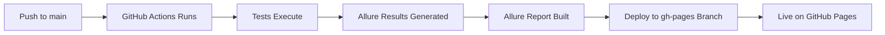

# GitHub Pages Setup for Allure Reports

This guide will help you enable GitHub Pages to view your Allure test reports online.

---

## 🎯 What You Get

Once enabled, your Allure reports will be automatically published at:

**https://cscharer.github.io/selenium_java_docker/**

Every push to the `main` branch will:
1. Run tests in CI/CD
2. Generate fresh Allure report
3. Deploy to GitHub Pages
4. Keep historical trend data

---

## 📋 One-Time Setup (2 minutes)

### Step 1: Enable GitHub Pages

1. Go to your repository on GitHub:
   ```
   https://github.com/CScharer/selenium_java_docker
   ```

2. Click **Settings** (top navigation)

3. Scroll down to **Pages** (left sidebar under "Code and automation")

4. Under **Build and deployment**:
   - **Source**: Select **Deploy from a branch**
   - **Branch**: Select **`gh-pages`** and **`/ (root)`**
   - Click **Save**

5. Wait 1-2 minutes for the initial deployment

### Step 2: Verify Deployment

1. Visit the GitHub Pages URL:
   ```
   https://cscharer.github.io/selenium_java_docker/
   ```

2. You should see the Allure report with:
   - 📊 Overview dashboard
   - 📈 Graphs (Status, Severity, Duration)
   - ✅ Test results from latest CI run
   - 📸 Screenshots attached to each test
   - 📉 Historical trends (after multiple runs)

---

## 🔄 How It Works

### Automatic Workflow



### What Happens on Each Push

1. **Trigger**: Push to `main` or `develop` branch
2. **Build**: Compile Java code
3. **Test**: Run tests on Chrome and Firefox in parallel
4. **Collect**: Gather `*-result.json` files from both browsers
5. **Merge**: Combine results into single dataset
6. **Generate**: Create Allure HTML report
7. **Deploy**: Push to `gh-pages` branch (main branch only)
8. **Publish**: GitHub Pages serves the report

---

## 📊 What You'll See in the Report

### Overview Page
- **Total Tests**: Count and pass/fail rate
- **Duration**: Total test execution time
- **Environment**: Browser, Java version, Selenium version
- **Graphs**:
  - Status chart (passed/failed/broken/skipped)
  - Severity distribution
  - Duration trend
  - Flaky tests detection

### Suites Page
- All test suites organized by package
- Pass/fail status per suite
- Duration per suite
- Failed test details

### Graphs Page
- Status trend over time
- Duration trend
- Retries and flakiness
- Categories

### Timeline Page
- Test execution timeline
- Parallel execution visualization
- Test dependencies

### Behaviors Page
- Organized by Epic → Feature → Story
- Business-readable test organization
- Requirements traceability

### Test Details
For each test:
- ✅ Status (passed/failed/broken)
- ⏱️ Duration
- 📸 Screenshots (success and failure)
- 🌐 Browser info
- 📄 Page source (on failure)
- 📝 Console logs (on failure)
- 📋 Test steps with Allure.step()

---

## 🔍 Monitoring CI/CD Runs

### Check Workflow Status

1. **Actions Tab**:
   ```
   https://github.com/CScharer/selenium_java_docker/actions
   ```

2. Look for **"Selenium Grid CI/CD Pipeline"** workflow

3. Click on the latest run to see:
   - ✅ Build & Compile
   - ✅ Grid Tests - chrome
   - ✅ Grid Tests - firefox
   - ✅ Generate Allure Report
   - ✅ Code Quality Analysis
   - ✅ Docker Build Test
   - ✅ Test Summary

### Verify Allure Results Generated

In the workflow run, check the **"Debug test results"** step:

```bash
# Should show:
✅ target/allure-results/ exists
✅ *-result.json files found (3+ files per browser)
✅ *-attachment.png files found (screenshots)
✅ *-container.json files found (structure)
```

### Download Artifacts (Alternative Method)

If you want to view the report locally:

1. Scroll to **Artifacts** section at bottom of workflow run
2. Click **"allure-report"** to download
3. Extract the ZIP file
4. Open `index.html` in your browser

---

## 🚨 Troubleshooting

### Report Shows 404s or "Loading..."

**Cause**: No Allure result files were generated during test execution.

**Solution**:
1. Check the **"Debug test results"** step in GitHub Actions
2. Verify `*-result.json` files exist in `target/allure-results/`
3. Ensure tests are running with TestNG suite XML:
   ```bash
   ./mvnw test -DsuiteXmlFile=testng-ci-suite.xml
   ```
4. Confirm `testng-ci-suite.xml` has `<listeners>` section:
   ```xml
   <listeners>
       <listener class-name="io.qameta.allure.testng.AllureTestNg"/>
   </listeners>
   ```

### GitHub Pages Shows 404 (Page Not Found)

**Cause**: `gh-pages` branch doesn't exist yet.

**Solution**:
1. Wait for first CI run to complete (creates `gh-pages` branch)
2. Then enable GitHub Pages in Settings
3. Refresh after 1-2 minutes

### Report Not Updating

**Cause**: GitHub Pages cache.

**Solution**:
1. Hard refresh browser: `Cmd+Shift+R` (Mac) or `Ctrl+Shift+R` (Windows)
2. Or add `?refresh=timestamp` to URL

### Deployment Permission Denied

**Cause**: Workflow doesn't have write permissions.

**Solution**: Already configured in `.github/workflows/ci.yml`:
```yaml
permissions:
  contents: write  # Required for GitHub Pages deployment
```

---

## 📈 Historical Trends

After multiple CI runs, you'll see:
- **Trend graphs** showing test stability over time
- **Flaky test detection** - tests that sometimes fail
- **Duration trends** - performance regressions
- **History** - Previous report data preserved

The `keep_files: false` setting ensures each deployment is fresh, but Allure's built-in history mechanism preserves trend data in the report itself.

---

## 🎯 Quick Reference

| Item | URL/Command |
|------|-------------|
| **Live Report** | https://cscharer.github.io/selenium_java_docker/ |
| **GitHub Actions** | https://github.com/CScharer/selenium_java_docker/actions |
| **Settings** | https://github.com/CScharer/selenium_java_docker/settings/pages |
| **Local Report** | `./mvnw allure:serve` (after running tests) |
| **Manual Deploy** | Handled by CI/CD automatically |

---

## ✅ Verification Checklist

After enabling GitHub Pages, verify:

- [ ] Workflow runs successfully (all jobs green)
- [ ] Debug step shows `*-result.json` files found
- [ ] Allure Report job shows "Report generated successfully!"
- [ ] Deploy to GitHub Pages job succeeds
- [ ] GitHub Pages URL loads the report
- [ ] Overview page shows test statistics (not "Loading...")
- [ ] Suites page lists test classes
- [ ] Individual tests show screenshots
- [ ] No 404 errors in the report

---

## 🔄 Next Steps After Setup

1. **View Report**: Visit https://cscharer.github.io/selenium_java_docker/
2. **Run More Tests**: Push changes to trigger new CI run
3. **Monitor Trends**: Watch historical data accumulate
4. **Share Report**: Send URL to team members (it's public!)

---

## 📚 Additional Resources

- [Allure Documentation](https://docs.qameta.io/allure/)
- [GitHub Pages Docs](https://docs.github.com/en/pages)
- [Our Allure Implementation](ALLURE_REPORTING.md)
- [CI/CD Troubleshooting](CI_TROUBLESHOOTING.md)

---

**Created**: November 8, 2025
**Last Updated**: November 8, 2025
